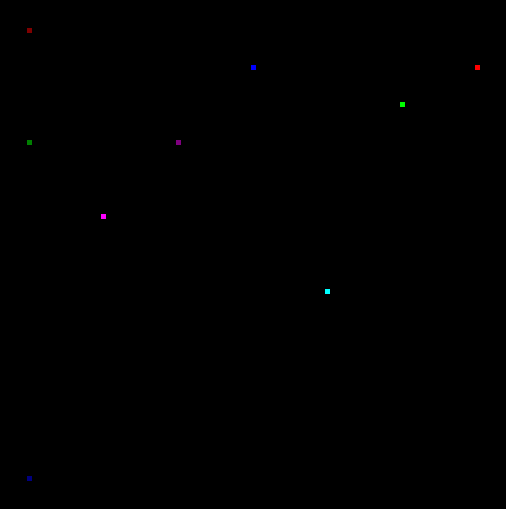

# GO-GRAPHER

---


This is a simple library for golang that allows plotting of simple datasets.

Currently, there is support for pie charts, bar charts, and scatter charts.


The ```main.go``` file uses SDL2 for displaying the plots, however this can be omitted in favor of whatever solution you use. Plots are rendered to simple pixel arrays.


**Sample Pie Chart:**


**Sample Bar Chart:**


**Sample Scatter Chart:**


